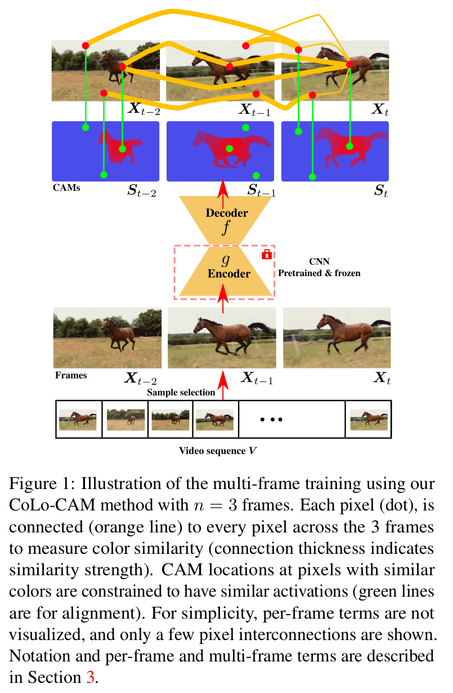

### Pytorch code for:
`CoLo-CAM: Class Activation Mapping for Object Co-Localization in Weakly-Labeled Unconstrained Videos`

ArXiv: [https://arxiv.org/abs/2208.14542](https://arxiv.org/abs/xxxx.xxxxx)

### Citation:
```
@article{belharbi2023colocam,
  title={CoLo-CAM: Class Activation Mapping for Object Co-Localization in Weakly-Labeled Unconstrained Videos},
  author={Belharbi, S. and Murtaza, S. and Pedersoli, M. and Ben Ayed, I. and 
  McCaffrey, L. and Granger, E.},
  journal={CoRR},
  volume={abs/xxxx.xxxxx},
}
```

### Issues:
Please create a github issue.

### Content:
* [Method](#method)
* [Results](#results)
* [Requirements](#re2q)
* [Datasets](#datasets)
* [Run code](#run)


#### <a name='method'> Method</a>:


#### <a name='results'> Results</a>:
More demo: [here](https://drive.google.com/drive/folders/14KysyAoFfF-3_ruSwzObBz3AS0G6xG93?usp=share_link)

#### <a name='reqs'> Requirements</a>:

See full requirements at [./dependencies/requirements.txt](./dependencies/requirements.txt)

* Python 3.10
* [Pytorch](https://github.com/pytorch/pytorch)  1.12.1
* [torchvision](https://github.com/pytorch/vision) 0.13.1
* [Full dependencies](dependencies/requirements.txt)
* Build and install CRF:
    * Install [Swig](http://www.swig.org/index.php)
    * CRF
```shell
cdir=$(pwd)
cd dlib/crf/crfwrapper/bilateralfilter
swig -python -c++ bilateralfilter.i
python setup.py install
cd $cdir
cd dlib/crf/crfwrapper/colorbilateralfilter
swig -python -c++ colorbilateralfilter.i
python setup.py install
```

#### <a name="datasets"> Download datasets </a>:
You can use these scripts to download the datasets: [cmds](./cmds). Use the
script [_video_ds_ytov2_2.py](./dlib/datasets/_video_ds_ytov2_2.py) to
reformat YTOv2.2.

Once you download the datasets, you need to adjust the paths in
[get_root_wsol_dataset()](dlib/configure/config.py).

#### <a name="run"> Run code </a>:
Examples on how to run the code.

1. WSOL baselines: LayerCAM over YouTube-Objects-v1.0 using ResNet50:
```shell
cudaid=0
export CUDA_VISIBLE_DEVICES=$cudaid

getfreeport() {
freeport=$(python -c 'import socket; s=socket.socket(); s.bind(("", 0)); print(s.getsockname()[1]); s.close()') 
}
export OMP_NUM_THREADS=50
export NCCL_BLOCKING_WAIT=1 
getfreeport
torchrun --nnodes=1 --node_rank=0 --nproc_per_node=1 --master_port=$freeport main.py --local_world_size=1 \
       --task STD_CL \
       --encoder_name resnet50 \
       --arch STDClassifier \
       --opt__name_optimizer sgd \
       --dist_backend gloo \
       --batch_size 32 \
       --max_epochs 100 \
       --checkpoint_save 100 \
       --keep_last_n_checkpoints 10 \
       --freeze_cl False \
       --freeze_encoder False \
       --support_background True \
       --method LayerCAM \
       --spatial_pooling WGAP \
       --dataset YouTube-Objects-v1.0 \
       --box_v2_metric False \
       --cudaid $cudaid \
       --debug_subfolder DEBUG \
       --amp True \
       --plot_tr_cam_progress False \
       --opt__lr 0.001 \
       --opt__step_size 15 \
       --opt__gamma 0.9 \
       --opt__weight_decay 0.0001 \
       --sample_fr_limit 0.6 \
       --std_label_smooth False \
       --exp_id 03_14_2023_19_49_04_857184__2897019
```
Train until convergence, then store the cams of trainset to be used later.
From the experiment folder, copy both folders 'YouTube-Objects-v1.
0-resnet50-LayerCAM-WGAP-cp_best_localization-boxv2_False'
and 'YouTube-Objects-v1.0-resnet50-LayerCAM-WGAP-cp_best_classification
-boxv2_False' to the folder 'pretrained'. They contain best weights which
will be loaded by CoLo-CAM model.

2. CoLo-CAM: Run:
```shell
cudaid=0
export CUDA_VISIBLE_DEVICES=$cudaid

getfreeport() {
freeport=$(python -c 'import socket; s=socket.socket(); s.bind(("", 0)); print(s.getsockname()[1]); s.close()') 
}
export OMP_NUM_THREADS=50
export NCCL_BLOCKING_WAIT=1 
getfreeport
torchrun --nnodes=1 --node_rank=0 --nproc_per_node=1 --master_port=$freeport main.py --local_world_size=1 \
       --task CoLo-CAM \
       --encoder_name resnet50 \
       --arch UnetCoLoCAM \
       --opt__name_optimizer sgd \
       --dist_backend gloo \
       --batch_size 32 \
       --max_epochs 10 \
       --checkpoint_save 100 \
       --keep_last_n_checkpoints 10 \
       --freeze_cl True \
       --support_background True \
       --method LayerCAM \
       --spatial_pooling WGAP \
       --dataset YouTube-Objects-v1.0 \
       --box_v2_metric False \
       --cudaid $cudaid \
       --debug_subfolder DEBUG \
       --amp True \
       --plot_tr_cam_progress False \
       --opt__lr 0.01 \
       --opt__step_size 5 \
       --opt__gamma 0.9 \
       --opt__weight_decay 0.0001 \
       --sample_fr_limit 0.6 \
       --elb_init_t 1.0 \
       --elb_max_t 10.0 \
       --elb_mulcoef 1.01 \
       --sample_n_from_seq 2 \
       --min_tr_batch_sz -1 \
       --drop_small_tr_batch False \
       --sample_n_from_seq_style before \
       --sample_n_from_seq_dist uniform \
       --sl_clc True \
       --sl_clc_knn_t 0.0 \
       --sl_clc_seed_epoch_switch_uniform -1 \
       --sl_clc_epoch_switch_to_sl -1 \
       --sl_clc_min_t 0.0 \
       --sl_clc_lambda 1.0 \
       --sl_clc_min 1000 \
       --sl_clc_max 1000 \
       --sl_clc_ksz 3 \
       --sl_clc_max_p 0.7 \
       --sl_clc_min_p 0.1 \
       --sl_clc_seed_tech seed_weighted \
       --sl_clc_use_roi True \
       --sl_clc_roi_method largest \
       --sl_clc_roi_min_size 0.05 \
       --crf_clc True \
       --crf_clc_lambda 2e-09 \
       --crf_clc_sigma_rgb 15.0 \
       --crf_clc_sigma_xy 100.0 \
       --rgb_jcrf_clc True \
       --rgb_jcrf_clc_lambda 9.0 \
       --rgb_jcrf_clc_lambda_style adaptive \
       --rgb_jcrf_clc_sigma_rgb 15.0 \
       --rgb_jcrf_clc_input_data image \
       --rgb_jcrf_clc_input_re_dim -1 \
       --rgb_jcrf_clc_start_ep 0 \
       --max_sizepos_clc True \
       --max_sizepos_clc_lambda 0.01 \
       --exp_id 03_14_2023_19_16_58_282581__5931773
```
